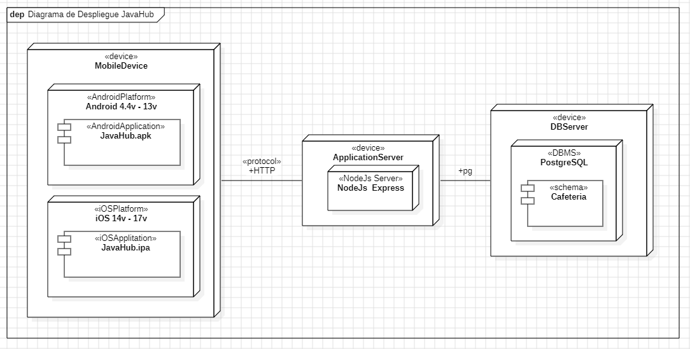
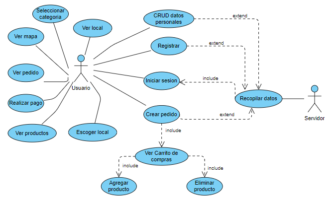
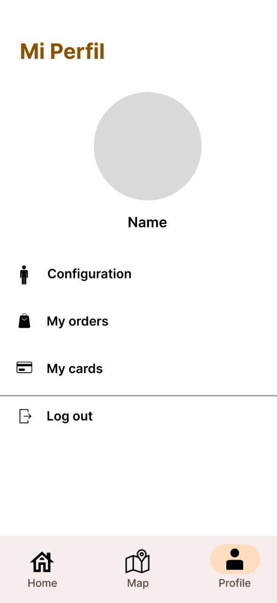
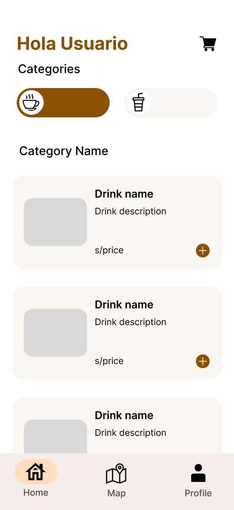
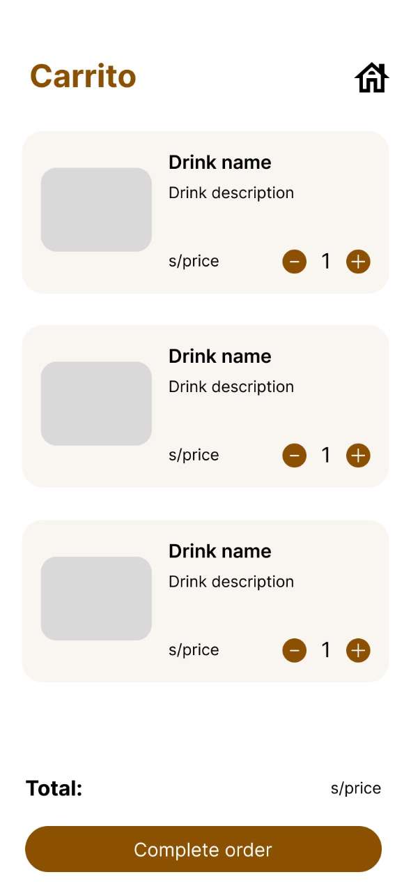
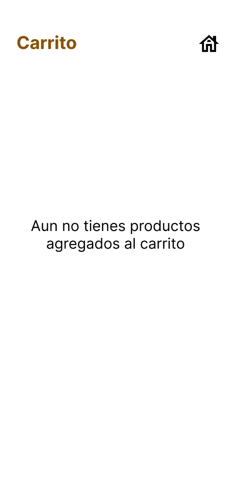
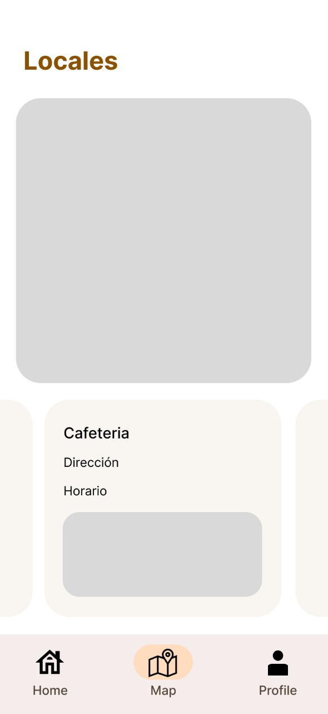
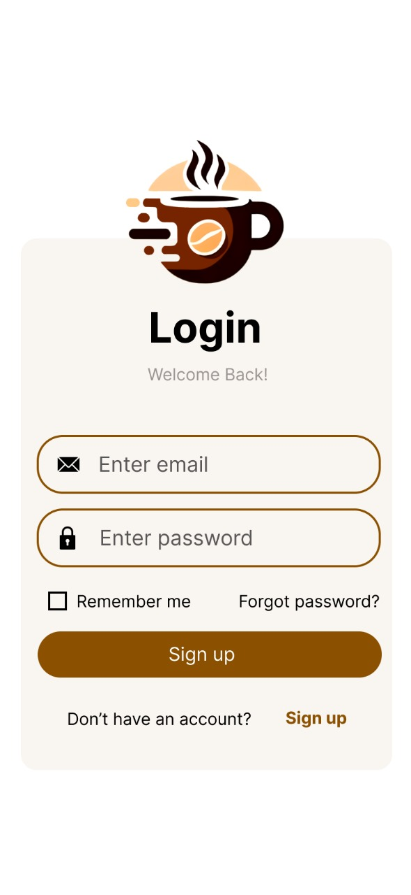
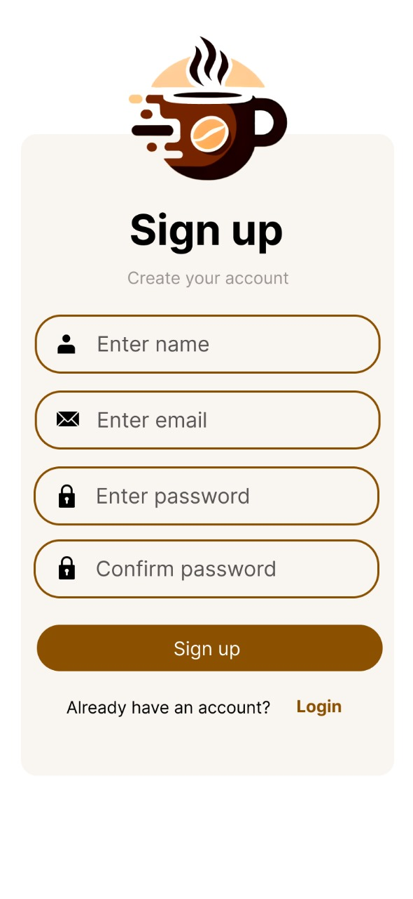

# APLICACIÓN MÓVIL DE CAFETERÍA - JAVAHUB
---
  - [Introducción](#introducción).
  - [Flutter](#flutter)
  - [PostreSQL](#postresql)
  - [Diagrama de Despliegue](#diagrama-de-despliegue)
  - [Requerimientos no Funcionales](#requerimientos-no-funcionales)
  - [Diagrama de Casos de Uso](#diagrama-de-casos-de-uso)
    - [Requerimientos Funcionales](#requerimientos-funcionales)
    - [Descripción de Casos de Uso](#descripción-de-casos-de-uso)

---
## Introducción
Para la aplicación, se usó Flatter para el desarrollo propio de la aplicación, con el objetivo de que se pueda usar tanto en dispositivos móviles Android y iOs. Por el lado del backed, este se desarrolló en NodeJs Express y la base de datos en PostgreSQL.

---
## Flutter
Para el desarrollo de esta aplicación móvil instalamos Visual Studio Code como entorno de desarrollo desde el sitio oficial y seguimos las instrucciones de instalación hasta completarla. 

Para el frontend, instalamos adicionalmente las extensiones de Flutter y Dart, las cuales nos permitirán escribir y depurar el código de manera más eficiente. La extensión de Flutter proporciona herramientas para crear, editar y depurar aplicaciones. La extensión de Dart ofrece soporte para el lenguaje de programación Dart, utilizado en el desarrollo de aplicaciones en Flutter. Luego, tuvimos que instalar el SDK al no tenerlo descargado previamente, el cual incluye herramientas y bibliotecas a usarse en Flutter. Lo descargamos del sitio oficial de Flutter y seguimos las instrucciones de instalación. Posteriormente, configuramos la ruta del SDK de Flutter en Visual Studio Code para que pudiéramos acceder a él. Finalmente, para poder visualizar y probar la aplicación en un entorno simulado de un dispositivo Android instalamos el Android Studio desde el sitio web oficial. Esta herramienta proporciona un emulador de Android que se puede integrar con Visual Studio Code para ejecutar y depurar aplicaciones. 

---
## PostreSQL
Para el backend, decidimos implementar pgAdmin para administrar las operaciones de datos de la aplicación. En primer lugar, antes de iniciar la descarga, verificamos los requisitos del sistema en la página oficial de pgAdmin para asegurarnos de que nuestras laptops cumplieran con las especificaciones necesarias. Una vez confirmado esto, procedimos a la página de descargas de pgAdmin, donde seleccionamos el instalador para Windows. Optamos por la versión más reciente, pgAdmin 4, y descargamos el archivo instalador adecuado para la arquitectura de 64 bits de nuestro sistema. Luego, ejecutamos el instalador descargado y nos mostró el cuadro de diálogo de instalación. El asistente de instalación nos guió a través de varios pasos, incluyendo la aceptación de licencias, la selección de ubicación de instalación y la configuración de componentes adicionales. Una vez completada la instalación, lanzamos pgAdmin desde el menú de inicio y establecimos una contraseña maestra para proteger las credenciales de las bases de datos almacenadas. Después, nos conectamos al servidor de base de datos predeterminado de PostgreSQL que ya estaba configurado en el sistema y creamos una nueva base de datos llamada "CafeteriaDB" destinada a manejar todas las operaciones relacionadas con la cafetería. Por último, realizamos pruebas para asegurarnos de que la conexión a la base de datos fuera estable, ejecutando consultas SQL básicas para verificar la conectividad como un SELECT.

---
## Diagrama de Despliegue

---
## Requerimientos no Funcionales
| Concepto|Descripción|
| ---------------------------- | --------------------------------------------------------------------------------------------------------------------------------------------------------------------------------------------------------------------------------------------------------------------------- |
| Identificación de requerimiento | RNF01|
| Características|La aplicación debe ser compatible con dispositivos iOS y Android para llegar a la mayor cantidad de usuarios posible.|
| Nombre del requerimiento |Multiplataforma|

| Concepto|Descripción|
| ---------------------------- | --------------------------------------------------------------------------------------------------------------------------------------------------------------------------------------------------------------------------------------------------------------------------- |
| Identificación de requerimiento | RNF02|
| Características|Se deben implementar medidas de seguridad para proteger los datos de los usuarios, como el cifrado de datos y la autenticación segura.|
| Nombre del requerimiento |Seguridad|

| Concepto|Descripción|
| ---------------------------- | --------------------------------------------------------------------------------------------------------------------------------------------------------------------------------------------------------------------------------------------------------------------------- |
| Identificación de requerimiento | RNF03|
| Características|La aplicación debe ser capaz de manejar un aumento en el número de usuarios y permitir hacer cambios a futuro.|
| Nombre del requerimiento |Escalabilidad|

| Concepto|Descripción|
| ---------------------------- | --------------------------------------------------------------------------------------------------------------------------------------------------------------------------------------------------------------------------------------------------------------------------- |
| Identificación de requerimiento | RNF04|
| Características|La aplicación debe estar disponible durante todo momento para los usuarios, con tiempos de inactividad mínimos para mantenimiento o actualizaciones.|
| Nombre del requerimiento |Disponibilidad|

| Concepto|Descripción|
| ---------------------------- | --------------------------------------------------------------------------------------------------------------------------------------------------------------------------------------------------------------------------------------------------------------------------- |
| Identificación de requerimiento | RNF05|
| Características|La aplicación debe poder manejar un gran número de usuarios simultáneos sin que afecte significativamente al rendimiento.|
| Nombre del requerimiento |Cantidad de usuario|

| Concepto|Descripción|
| ---------------------------- | --------------------------------------------------------------------------------------------------------------------------------------------------------------------------------------------------------------------------------------------------------------------------- |
| Identificación de requerimiento | RNF06|
| Características|La aplicación debe ser rápida y eficiente, con tiempos de carga rápidos y una respuesta fluida a las interacciones del usuario.|
| Nombre del requerimiento |Rendimiento|

| Concepto|Descripción|
| ---------------------------- | --------------------------------------------------------------------------------------------------------------------------------------------------------------------------------------------------------------------------------------------------------------------------- |
| Identificación de requerimiento | RNF07|
| Características|La aplicación debe ser fácil de usar, con una interfaz intuitiva y bien diseñada que permita a los usuarios navegar y realizar pedidos de manera sencilla y rápida.|
| Nombre del requerimiento |Usabilidad|

| Concepto|Descripción|
| ---------------------------- | --------------------------------------------------------------------------------------------------------------------------------------------------------------------------------------------------------------------------------------------------------------------------- |
| Identificación de requerimiento | RNF08|
| Características|La aplicación debe cumplir con las regulaciones y leyes locales en relación a ventas de productos alimenticios y seguir normativas de pagos en línea, principalmente que salvaguarde la seguridad de los pagos de los usuarios. Además, de incluir términos y condiciones que aborden políticas de privacidad y términos de servicio.|
| Nombre del requerimiento |Normativas legales|
---
## Diagrama de Casos de Uso

### Requerimientos Funcionales
A continuación se describen los requisitos funcionales de la aplicación hasta el momentos.
Se han detallados 14 requisitos.

| Concepto                                | Descripción                                                                          |
|-----------------------------------------|--------------------------------------------------------------------------------------|
| **Identificación**                      | RF01                                                                                 |
| **Identificación del Requerimiento** | Registrar Usuario                                                                    |
| **Características**                     | Los usuarios deberán registrarse en el sistema para poder entrar a este.          |
| **Descripción del Requerimiento**    | El sistema debe permitir crear una cuenta por medio de un formulario de registro. |

| Concepto                                | Descripción                                                                                                           |
|-----------------------------------------|-----------------------------------------------------------------------------------------------------------------------|
| **Identificación**                      | RF02                                                                                                                  |
| **Identificación del Requerimiento** | Iniciar Sesión                                                                                                        |
| **Características**                     | Los usuarios deberán iniciar sesión para acceder al sistema.                                                          |
| **Descripción del Requerimiento**    | El sistema debe permitir ingresar por medio de una cuenta generada con antelación, se pedirán correo y contraseña. |

| Concepto                                | Descripción                                                                                 |
|-----------------------------------------|---------------------------------------------------------------------------------------------|
| **Identificación**                      | RF03                                                                                        |
| **Identificación del Requerimiento** | Agregar Producto                                                                            |
| **Características**                     | Los usuarios deberán agregar productos a su carrito para proceder al pago de los mismos. |
| **Descripción del Requerimiento**    | El sistema debe permitir agregar un producto al carrito de  compras del usuario.         |

| Concepto                                | Descripción                                                                           |
|-----------------------------------------|---------------------------------------------------------------------------------------|
| **Identificación**                      | RF04                                                                                  |
| **Identificación del Requerimiento** | Eliminar Producto                                                                     |
| **Características**                     | Los usuarios podrán eliminar productos de su carrito en caso lo vean necesario.    |
| **Descripción del Requerimiento**    | El sistema debe permitir eliminar un producto del carrito de  compras del usuario. |

| Concepto                                | Descripción                                                                            |
|-----------------------------------------|----------------------------------------------------------------------------------------|
| **Identificación**                      | RF05                                                                                   |
| **Identificación del Requerimiento** | Ver productos                                                                          |
| **Características**                     | Los usuarios podrán ver la información detallada del producto.                         |
| **Descripción del Requerimiento**    | El sistema debe presentar una descripción del producto seleccionado por el usuario. |

| Concepto                                | Descripción                                                                                               |
|-----------------------------------------|-----------------------------------------------------------------------------------------------------------|
| **Identificación**                      | RF06                                                                                                      |
| **Identificación del Requerimiento** | Ver pedido                                                                                                |
| **Características**                     | Los usuarios podrán ver la información detallada de pedidos pasados y actuales.                           |
| **Descripción del Requerimiento**    | El sistema debe mostrar todos los pedidos hechos por el usuario, ya sean pasados o que estén en curso. |

| Concepto                                | Descripción                                                                                                   |
|-----------------------------------------|---------------------------------------------------------------------------------------------------------------|
| **Identificación**                      | RF07                                                                                                          |
| **Identificación del Requerimiento** | Ver mapa                                                                                                      |
| **Características**                     | Los usuarios tendrán acceso al mapa que muestra todas las locaciones de la cafetería.                         |
| **Descripción del Requerimiento**    | El sistema debe mostrar el mapa con todas las locaciones, haciendo énfasis en las más cercanas al usuario. |

| Concepto                                | Descripción                                                                                                          |
|-----------------------------------------|----------------------------------------------------------------------------------------------------------------------|
| **Identificación**                      | RF08                                                                                                                 |
| **Identificación del Requerimiento** | Escoger local                                                                                                        |
| **Características**                     | Los usuarios tendrán la posibilidad de elegir el lugar de recojo del pedido, entre todas las locaciones listadas. |
| **Descripción del Requerimiento**    | El sistema debe mostrar al usuario todas las locaciones disponibles de recojo cerca suyo.                            |

| Concepto                                | Descripción                                                                                                                                            |
|-----------------------------------------|--------------------------------------------------------------------------------------------------------------------------------------------------------|
| **Identificación**                      | RF09                                                                                                                                                   |
| **Identificación del Requerimiento** | Ver local                                                                                                                                              |
| **Características**                     | Los usuarios tendrán acceso a una descripción detallada de los locales, la cual muestra: - Nombre del local - Horario - Imagen - Dirección |
| **Descripción del Requerimiento**    | El sistema debe mostrar al usuario una descripción, con los detalles mencionados, por cada uno de los locales.                                      |

| Concepto                                | Descripción                                                                                                                                       |
|-----------------------------------------|---------------------------------------------------------------------------------------------------------------------------------------------------|
| **Identificación**                      | RF10                                                                                                                                              |
| **Identificación del Requerimiento** | Seleccionar categorías                                                                                                                            |
| **Características**                     | Los usuarios tendrán la posibilidad de seleccionar diferentes categorías de bebidas.                                                              |
| **Descripción del Requerimiento**    | El sistema debe mostrar y permitir seleccionar al usuario las categorías de bebidas: - Hot Coffe - Iced Coffe - Chocolate - Signature |

| Concepto                                | Descripción                                                                                 |
|-----------------------------------------|---------------------------------------------------------------------------------------------|
| **Identificación**                      | RF11                                                                                        |
| **Identificación del Requerimiento** | CRUD datos personales                                                                       |
| **Características**                     | Los usuarios tendrán la posibilidad de editar, eliminar, agregar, ver sus datos personales. |
| **Descripción del Requerimiento**    | El sistema permitirá el CRUD de datos personales del usuario.                               |

| Concepto                                | Descripción                                                                                                                                                       |
|-----------------------------------------|-------------------------------------------------------------------------------------------------------------------------------------------------------------------|
| **Identificación**                      | RF12                                                                                                                                                              |
| **Identificación del Requerimiento** | Ver carrito de compras                                                                                                                                            |
| **Características**                     | Los usuarios podrán acceder a su carrito personal donde estarán todos los productos que hayan agregado. A su vez, podrán editar los productos y/o eliminarlos. |
| **Descripción del Requerimiento**    | El sistema mostrará al usuario todos los productos agregados a su carrito, con la capacidad de editarlos y/o eliminarlos.                                      |

| Concepto                                | Descripción                                                                                                          |
|-----------------------------------------|----------------------------------------------------------------------------------------------------------------------|
| **Identificación**                      | RF13                                                                                                                 |
| **Identificación del Requerimiento** | Crear pedido                                                                                                         |
| **Características**                     | Los usuarios podrán crear un pedido con todos los productos de su carrito.                                           |
| **Descripción del Requerimiento**    | El sistema permitirá al usuario crear un pedido que incluya todos los productos y especificaciones de su carrito. |

| Concepto                                | Descripción                                                                                                                          |
|-----------------------------------------|--------------------------------------------------------------------------------------------------------------------------------------|
| **Identificación**                      | RF14                                                                                                                                 |
| **Identificación del Requerimiento** | Realizar pago                                                                                                                        |
| **Características**                     | Los usuarios podrán pagar un pedido una vez este haya sido creado por medio de tarjeto o billeteras virtuales.                    |
| **Descripción del Requerimiento**    | El sistema permitirá al usuario pagar su pedido por medio de una tarjeta de crédito/débito o por una billetera virtual Yape/Plin. |

### Descripción de Casos de Uso
| Concepto                       | Descripción                                                                                                                                                                                                                                                                 |
|--------------------------------|-----------------------------------------------------------------------------------------------------------------------------------------------------------------------------------------------------------------------------------------------------------------------------|
| *Requerimientos Funcionales* | Editar datos de usuario,  Ver pedido,  CRUD datos personales                                                                                                                                                                                                                |
| *Descripción*                | En la pantalla de Mi Perfil el usuario puede ver su foto de usuario y su nombre, además se visualizan las opciones de configuración, mis órdenes, mis tarjetas y un botón para salir de la sesión. En esta vista también se podrá editar el nombre y la imagen del usuario. |
| *Vista*                      |                                                                                                                                                                                                                                                                             |

| Concepto                       | Descripción                                                                                                                                                 |
|--------------------------------|-------------------------------------------------------------------------------------------------------------------------------------------------------------|
| *Requerimientos Funcionales* | Agregar productos Seleccionar categorías Ver productos                                                                                                      |
| *Descripción*                | En esta vista el usuario puede añadir bebidas al carrito dependiendo de cada categoría; de cada bebida se muestra el nombre, descripción, imagen y precio.  |
| *Vista*                      |                                                                                                                                                                |

| Concepto                       | Descripción                                                                                                                                                 |
|--------------------------------|-------------------------------------------------------------------------------------------------------------------------------------------------------------|
| *Requerimientos Funcionales* | Agregar productos, Eliminar producto, Realizar pago, Ver productos                                                                                                      |
| *Descripción*                | En el carrito se tiene información sobre las bebidas seleccionadas, se tiene cuántas bebidas han sido seleccionadas y si se desea añadir o eliminar bebidas. Además se ve el total de todo el pedido. Por otro lado si no hay ninguna bebida agregada al carrito se muestra un mensaje.  |
| *Vista*                      |                                                                                                            |

| Concepto                       | Descripción                                                                                                                                                                                                                    |
|--------------------------------|--------------------------------------------------------------------------------------------------------------------------------------------------------------------------------------------------------------------------------|
| *Requerimientos Funcionales* | Ver mapa Escoger local Ver local                                                                                                                                                                                               |
| *Descripción*                | En la vista de locales se ve un mapa de los locales más cercanos a ti, debajo de eso se tiene un carrusel en el cual puedes escoger a qué local ir, ademas se ve la información del local, como la dirección, horario e imagen |
| *Vista*                      |                                                                                                                                                                                                                                |

| Concepto                       | Descripción                                                                                                                                                                                                                                                                                    |
|--------------------------------|------------------------------------------------------------------------------------------------------------------------------------------------------------------------------------------------------------------------------------------------------------------------------------------------|
| *Requerimientos Funcionales* | Inicio de Sesión usuario                                                                                                                                                                                                                                                                       |
| *Descripción*                | En la pantalla del Login se pide el email y la contraseña para poder acceder a la cuenta, además se tiene una casilla para recordar al usuario. Por si el usuario se olvidó su contraseña puede presionar para recuperarla. Por otro lado, si no se tiene una cuenta hay la opción de Sign up. |
| *Vista*                      |                                                                                                                                                                                                                                                                                                |

| Concepto                       | Descripción                                                                                                                  |
|--------------------------------|------------------------------------------------------------------------------------------------------------------------------|
| *Requerimientos Funcionales* | Registro de Usuario                                                                                                          |
| *Descripción*                | Para registrarte debes ingresar tu nombre, email, contraseña y repetir contraseña. En caso tengas ya una cuenta dar al login |
| *Vista*                      |                                                                                                                              |

